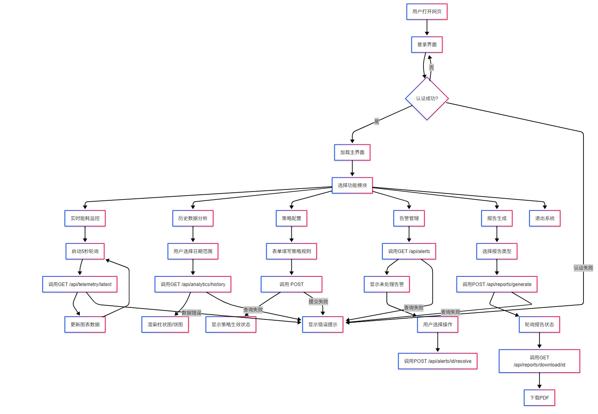
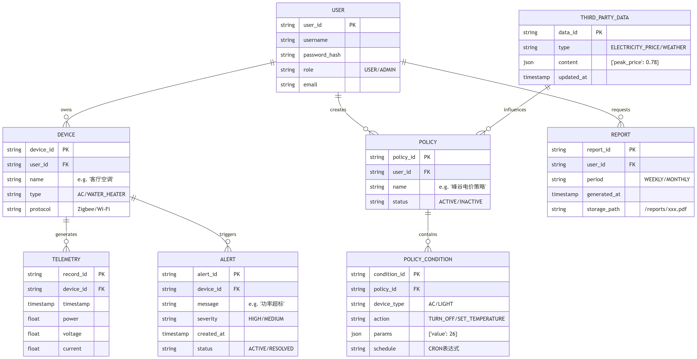

update by Xiaorui Zhao, May 26, 2025

## 功能流程图


    

    graph TD
        A[用户打开网页] --> B[登录界面]
        B --> C{认证成功?}
        C -- 是 --> D[加载主界面]
        C -- 否 --> B
        D --> E[选择功能模块]
    %% 实时监控模块
    E --> F[实时能耗监控]
    F --> F1[启动5秒轮询]
    F1 --> F2[调用GET /api/telemetry/latest]
    F2 --> F3[更新图表数据]
    F3 --> F1
    
    %% 历史分析模块
    E --> G[历史数据分析]
    G --> G1[用户选择日期范围]
    G1 --> G2[调用GET /api/analytics/history]
    G2 --> G3[渲染柱状图/饼图]
    
    %% 策略管理模块
    E --> H[策略配置]
    H --> H1[表单填写策略规则]
    H1 --> H2[调用POST /api/policies]
    H2 --> H3[显示策略生效状态]
    
    %% 告警处理模块
    E --> I[告警管理]
    I --> I1[调用GET /api/alerts]
    I1 --> I2[显示未处理告警]
    I2 --> I3[用户选择操作]
    I3 --> I4[调用POST /api/alerts/id/resolve]
    
    %% 报告生成模块
    E --> J[报告生成]
    J --> J1[选择报告类型]
    J1 --> J2[调用POST /api/reports/generate]
    J2 --> J3[轮询报告状态]
    J3 --> J4[调用GET /api/reports/download/id]
    J4 --> J5[下载PDF]
    
    E --> L[退出系统]
    
    %% 全局异常处理
    C -- 认证失败 --> K[显示错误提示]
    F2 -- 数据错误 --> K
    G2 -- 查询失败 --> K
    I1 -- 查询失败 --> K
    H2 -- 提交失败 --> K
    J2 -- 查询失败 --> K
## ER 图



```
erDiagram
%% 实体定义
USER ||--o{ DEVICE : "owns"
USER {
string user_id PK
string username
string password_hash
string role "USER/ADMIN"
string email
}

DEVICE ||--o{ TELEMETRY : "generates"
DEVICE {
string device_id PK
string user_id FK
string name "e.g. '客厅空调'"
string type "AC/WATER_HEATER"
string protocol "Zigbee/Wi-Fi"
}

TELEMETRY {
string record_id PK
string device_id FK
timestamp timestamp
float power
float voltage
float current
}

POLICY ||--o{ POLICY_CONDITION : "contains"
POLICY {
string policy_id PK
string user_id FK
string name "e.g. '峰谷电价策略'"
string status "ACTIVE/INACTIVE"
}

POLICY_CONDITION {
string condition_id PK
string policy_id FK
string device_type "AC/LIGHT"
string action "TURN_OFF/SET_TEMPERATURE"
json params "{'value': 26}"
string schedule "CRON表达式"
}

ALERT {
string alert_id PK
string device_id FK
string message "e.g. '功率超标'"
string severity "HIGH/MEDIUM"
timestamp created_at
string status "ACTIVE/RESOLVED"
}

REPORT {
string report_id PK
string user_id FK
string period "WEEKLY/MONTHLY"
timestamp generated_at
string storage_path "/reports/xxx.pdf"
}

THIRD_PARTY_DATA {
string data_id PK
string type "ELECTRICITY_PRICE/WEATHER"
json content "{'peak_price': 0.78}"
timestamp updated_at
}

%% 关系说明
USER ||--o{ POLICY : "creates"
USER ||--o{ REPORT : "requests"
DEVICE ||--o{ ALERT : "triggers"
THIRD_PARTY_DATA ||--o{ POLICY : "influences"
```

