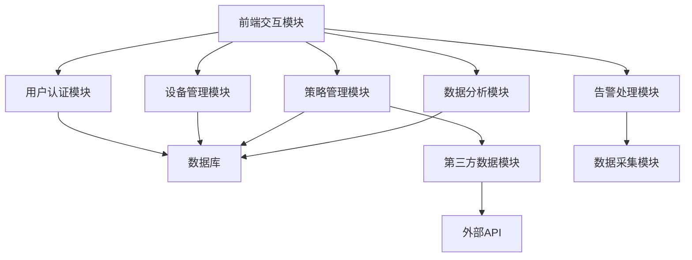

# 智能家居能源管理系统模块划分与接口设计文档

**更新时间**：2025年5月26日
**作者**：Xiaorui Zhao, JiachengGuo

## 目录

1. **系统模块划分**
   1.1 模块职责与功能
   1.2 模块依赖关系
2. **接口设计规范**
   2.1 RESTful 设计原则
   2.2 公共请求/响应格式
   2.3 安全与鉴权
3. **详细接口定义**
   3.1 用户认证与权限管理模块
   3.2 设备管理模块
   3.3 数据采集与遥测模块
   3.4 策略管理模块
   3.5 告警处理模块
   3.6 数据分析与报告模块
   3.7 第三方数据集成模块
4. **模块间通信与数据流**
5. **异常处理与日志设计**
6. **附录**

---

## 1. 系统模块划分

### 1.1 模块职责与功能

| 模块名称                     | 核心职责                               | 关键功能                                                                           |
| ---------------------------- | -------------------------------------- | ---------------------------------------------------------------------------------- |
| **用户认证与权限管理** | 管理用户身份验证、权限分配与会话控制   | - 用户登录/登出<br>- 角色权限校验（USER/ADMIN）<br>- Token 签发与管理              |
| **设备管理模块**       | 管理设备注册、状态监控与设备生命周期   | - 设备注册/注销<br>- 设备状态实时查询<br>- 批量设备操作（如“离家模式”）          |
| **数据采集与遥测模块** | 实时采集设备数据并存储                 | - 5秒轮询设备数据<br>- 数据清洗与存储<br>- 提供实时数据接口                        |
| **策略管理模块**       | 管理用户自定义的节能策略与自动化规则   | - 策略创建/修改/删除<br>- 策略条件动态计算（结合第三方数据）<br>- 策略执行状态监控 |
| **告警处理模块**       | 监测异常数据并触发告警流程             | - 实时异常检测（功率超标、设备故障）<br>- 告警分级处理<br>- 告警状态同步           |
| **数据分析与报告模块** | 处理历史数据分析与可视化报告生成       | - 能耗排名计算<br>- 报告生成与下载<br>- 节能目标进度跟踪                           |
| **第三方数据集成模块** | 集成外部数据源（电价、天气）以优化策略 | - 电价政策实时同步<br>- 天气数据获取<br>- 数据缓存与更新                           |
| **前端交互模块**       | 提供用户操作界面与可视化展示           | - 实时监控面板<br>- 历史数据图表渲染<br>- 语音指令接入                             |

### 1.2 模块依赖关系



---

## 2. 接口设计规范

### 2.1 RESTful 设计原则

- **HTTP方法**：`GET`（查询）、`POST`（新增）、`PUT`（全量更新）、`PATCH`（部分更新）、`DELETE`（删除）
- **状态码**：
  - `200 OK`：成功
  - `401 Unauthorized`：未授权
  - `400 Bad Request`：参数错误
  - `500 Internal Server Error`：服务端异常

### 2.2 公共请求/响应格式

```json
// 请求头
{
  "Authorization": "Bearer {JWT_TOKEN}",
  "Content-Type": "application/json"
}

// 成功响应
{
  "code": 200,
  "data": { ... },
  "message": "Success"
}

// 错误响应
{
  "code": 400,
  "error": "Invalid policy parameters",
  "details": "Field 'schedule' must be a valid CRON expression"
}
```

### 2.3 安全与鉴权

- **JWT 鉴权**：所有接口需携带 Token（除登录接口）
- **角色权限**：
  - `USER`：仅管理自身设备与策略
  - `ADMIN`：可访问全量数据与系统配置

---

## 3. 详细接口定义

### 3.1 用户认证与权限管理模块

| 接口名称   | 端点                  | 方法 | 描述                 | 请求/响应示例                                                             |
| ---------- | --------------------- | ---- | -------------------- | ------------------------------------------------------------------------- |
| 用户登录   | `/api/auth/login`   | POST | 用户登录并获取 Token | **Request Body**: `{ "username": "user1", "password": "******" }` |
|            |                       |      |                      | **Response**: `{ "token": "xxxx", "role": "USER" }`               |
| Token 刷新 | `/api/auth/refresh` | POST | 刷新过期的 Token     | **Request Header**: `Bearer {old_token}`                          |

### 3.2 设备管理模块

| 接口名称         | 端点                         | 方法 | 描述                           | 请求/响应示例                                                                      |
| ---------------- | ---------------------------- | ---- | ------------------------------ | ---------------------------------------------------------------------------------- |
| 获取用户设备列表 | `/api/devices`             | GET  | 查询用户所有设备               | **Response**: `[{ "device_id": "d1", "name": "客厅空调", "power": 1500 }]` |
| 批量关闭设备     | `/api/devices/batch-close` | POST | 触发“离家模式”关闭非必需设备 | **Request Body**: `{ "excluded_devices": ["d1"] }`                         |

### 3.3 数据采集与遥测模块

| 接口名称     | 端点                      | 方法 | 描述         | 请求/响应示例                                                                                     |
| ------------ | ------------------------- | ---- | ------------ | ------------------------------------------------------------------------------------------------- |
| 获取实时数据 | `/api/telemetry/latest` | GET  | 最新设备数据 | **Response**: `{ "device_id": "d1", "power": 1500, "timestamp": "2025-05-30T12:00:00Z" }` |

### 3.4 策略管理模块

| 接口名称     | 端点                          | 方法 | 描述             | 请求/响应示例                                                                                                                                                                    |
| ------------ | ----------------------------- | ---- | ---------------- | -------------------------------------------------------------------------------------------------------------------------------------------------------------------------------- |
| 创建策略     | `/api/policies`             | POST | 提交新的节能策略 | **Request Body**: `{ "name": "峰谷电价策略", "conditions": [{ "action": "TURN_OFF" "external_data_type": "ELECTRICITY_PRICE"  // 新增字段，指定依赖的第三方数据类型}] }` |
| 策略状态查询 | `/api/policies/{id}/status` | GET  | 查看策略执行状态 | **Response**: `{ "status": "ACTIVE", "last_triggered": "2025-05-30T12:00:00Z" }`                                                                                         |

### 3.5 告警处理模块

| 接口名称       | 端点                         | 方法 | 描述                                     | 请求/响应示例                                                                                                                             |
| -------------- | ---------------------------- | ---- | ---------------------------------------- | ----------------------------------------------------------------------------------------------------------------------------------------- |
| 获取未处理告警 | `/api/alerts`              | GET  | 查询未解决告警                           | **Response**: `[{ "alert_id": "a1", "message": "空调功率超标", "severity": "HIGH" }]`                                             |
| 解决告警       | `/api/alerts/{id}/resolve` | POST | 标记告警为已处理<br />自检验是否正确处理 | **Response**: `{ "code": 200, "message": "Alert resolved" "device_status_updated": true  // 新增字段，标记设备状态是否同步成功 }` |

### 3.6 数据分析与报告模块

| 接口名称     | 端点                           | 方法 | 描述                | 请求/响应示例                                                                 |
| ------------ | ------------------------------ | ---- | ------------------- | ----------------------------------------------------------------------------- |
| 生成月度报告 | `/api/reports/generate`      | POST | 创建自定义报告      | **Request Body**: `{ "period": "MONTHLY", "type": "ENERGY_SUMMARY" }` |
| 下载报告     | `/api/reports/download/{id}` | GET  | 下载生成的 PDF 报告 | **Response**: PDF 文件流                                                |

### 3.7 第三方数据集成模块

| 接口名称     | 端点                             | 方法 | 描述             | 请求/响应示例                                                          |
| ------------ | -------------------------------- | ---- | ---------------- | ---------------------------------------------------------------------- |
| 同步电价数据 | `/api/third-party/electricity` | GET  | 获取最新电价政策 | **Response**: `{ "peak_price": 0.78, "off_peak_price": 0.35 }` |

---

## 4. 模块间通信与数据流

- **实时数据流**：
  数据采集模块 → 数据库 → 告警模块（实时检测） → 前端展示
- **策略触发流程**：
  第三方数据更新 → 策略模块重新计算 → 设备管理模块执行动作
- **异步通信**：
  使用 RabbitMQ 消息队列处理高并发操作（如批量设备控制）

---

## 5. 异常处理与日志设计

- **异常分类**：
  - **业务异常**（如策略条件冲突）：返回 `4xx` 错误码与详细描述
  - **系统异常**（如数据库连接失败）：返回 `5xx` 错误码并触发告警
- **日志规范**：
  - 记录关键操作（如用户登录、策略修改）
  - 使用 ELK 栈（Elasticsearch, Logstash, Kibana）实现日志聚合与分析
